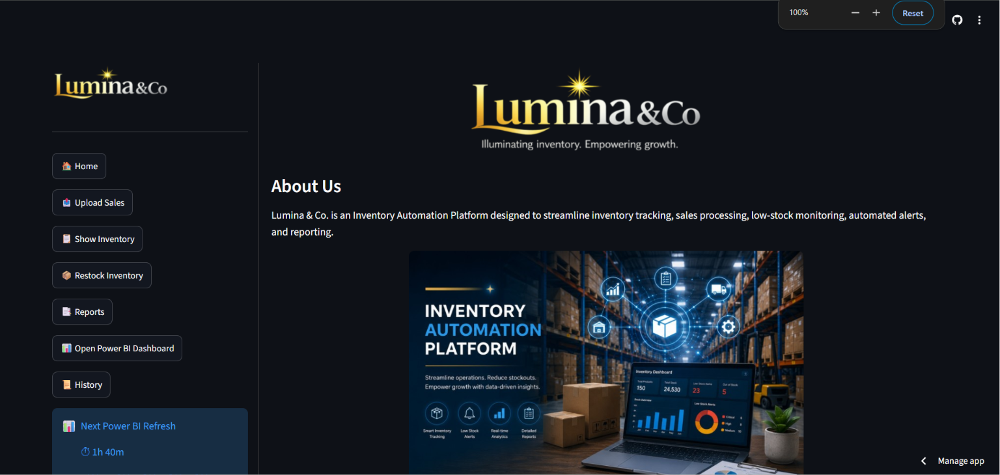
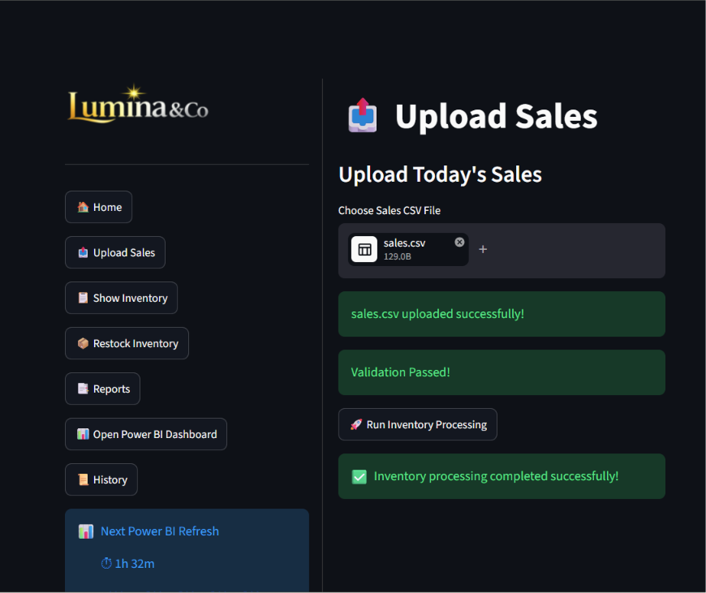
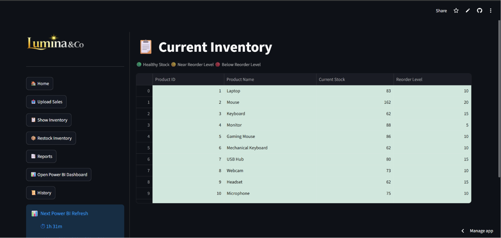
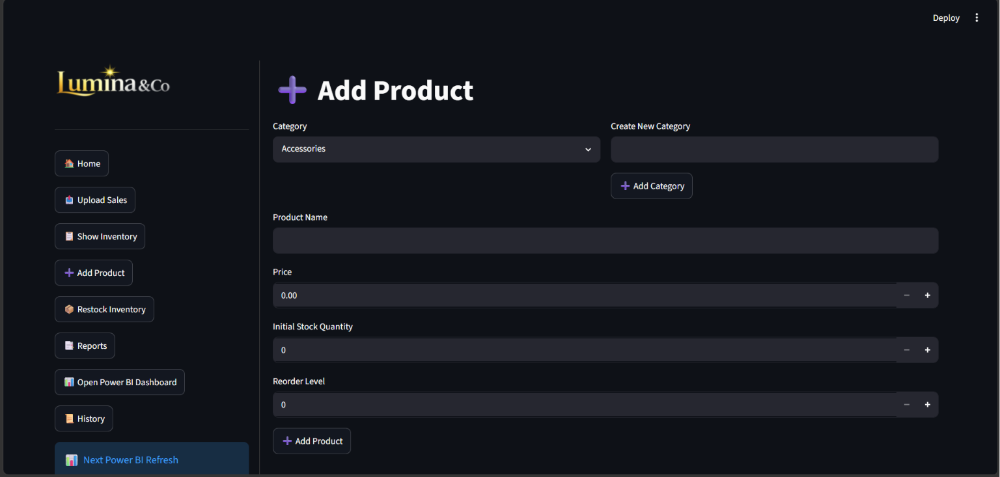
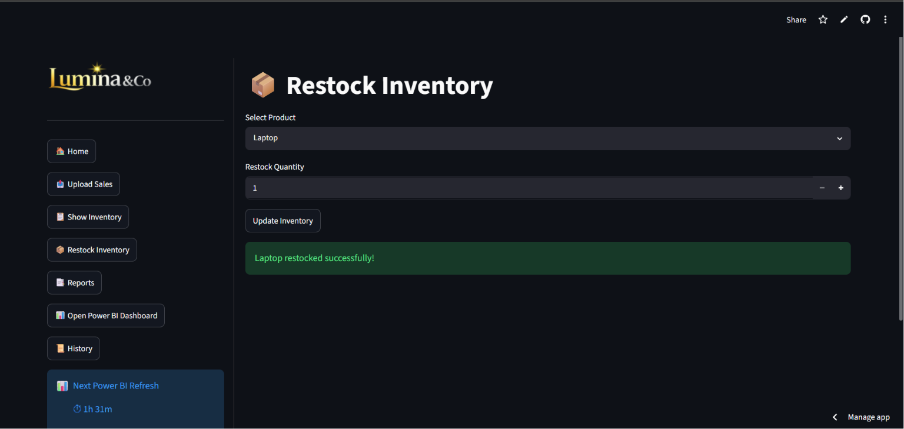
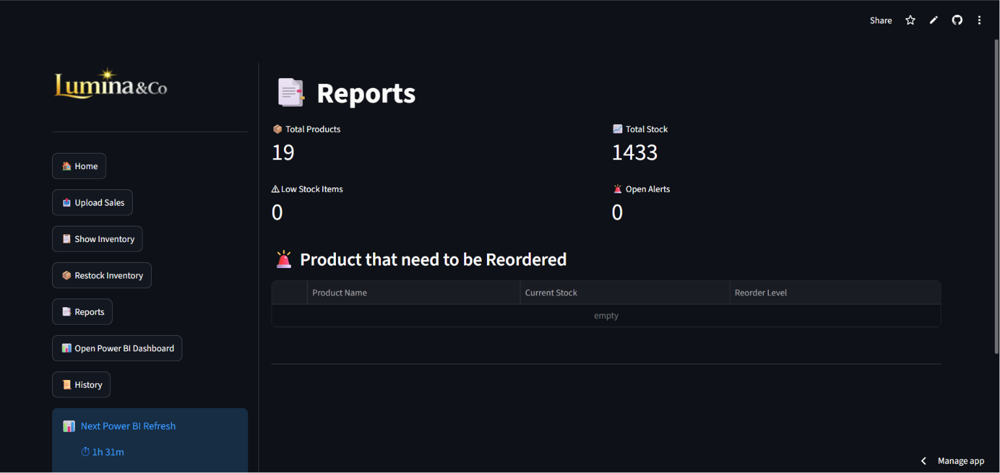
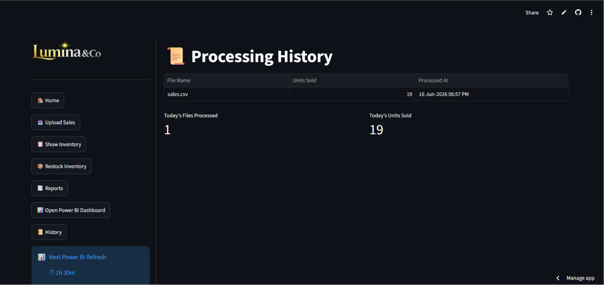
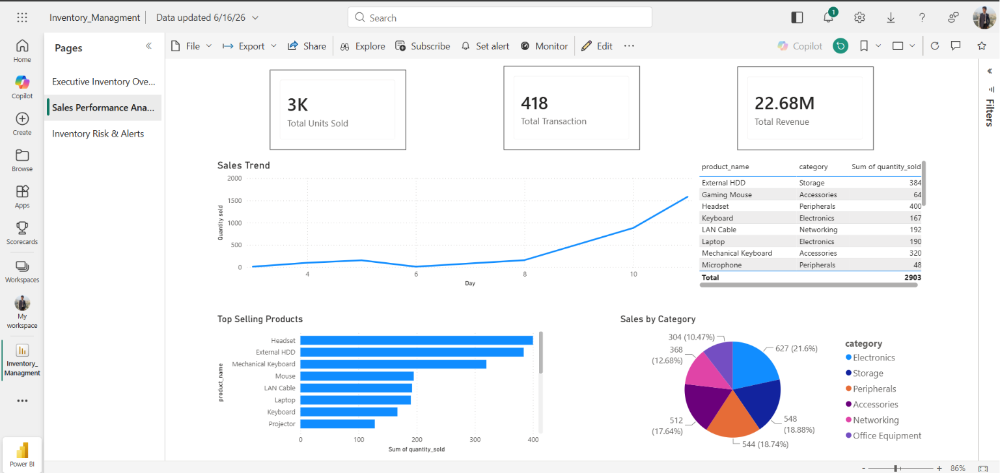

# 📦 Lumina Inventory Automation System

A cloud-based Inventory Management and Automation System built using Python, Streamlit, MySQL, and Power BI.

The system automates inventory updates from daily sales files, tracks stock levels in real-time, generates low-stock alerts, sends email notifications, and provides interactive reporting through Power BI dashboards.

---

## 🚀 Live Application

Streamlit App:
https://lumina-inventory-automation.streamlit.app

---

## 📌 Project Overview

Managing inventory manually can lead to stock shortages, inaccurate records, and delayed reporting.

This project automates the complete inventory workflow by:

* Uploading daily sales files
* Updating inventory automatically
* Generating low-stock alerts
* Sending email notifications
* Tracking processing history
* Visualizing inventory data in Power BI
* Managing inventory through a cloud-hosted web application

---

## 🛠️ Tech Stack

### Frontend

* Streamlit

### Backend

* Python

### Database

* MySQL (Aiven Cloud)

### Analytics

* Power BI

### Automation

* Python ETL Pipeline
* Email Notifications (SMTP)

### Deployment

* Streamlit Community Cloud
* Aiven Cloud Database

---

## ✨ Key Features

### 📤 Sales Upload & Validation

* Upload daily sales CSV files
* Automatic validation of file structure
* Product ID verification
* User-friendly error handling

### 🔄 Automated Inventory Processing

* Updates stock quantities automatically
* Maintains inventory accuracy
* Processes sales records in real time

### ⚠️ Low Stock Alert System

* Detects products below reorder levels
* Generates inventory alerts
* Sends automated email notifications

### 📦 Inventory Management

* View current inventory levels
* Color-coded stock status
* Search and monitor products
* Product Management
* Category Management

### ➕ Restock Management

* Update inventory quantities
* Instantly refresh stock levels

### Product Management

* Add new inventory products directly from the application
* Auto-generated Product IDs using MySQL AUTO_INCREMENT
* Product validation and duplicate prevention
* Category assignment and reorder level configuration
* Immediate inventory visibility after creation

### 📊 Reporting Dashboard

* Inventory analytics
* Sales summaries
* Low stock monitoring
* Power BI integration

### 🕒 Processing History

* Tracks processed files
* Records units sold
* Stores processing timestamps

---

---
## 📸 Application Screenshots

### Home Page

### Upload Sales

### Inventory Dashboard

#### Add Products

### Restock Inventory

### Reports

### Processing History

### Power BI Dashboard

---

## 📊 Power BI Dashboard

The Power BI dashboard provides:

* Inventory Overview
* Low Stock Monitoring
* Sales Analysis
* KPI Tracking
* Inventory Health Metrics

---

## 📧 Automated Email Alerts

The system automatically sends:

* Low Stock Alerts
* Daily Inventory Processing Summary
* Sales Processing Notifications

---

## 🎯 Business Impact

This solution helps organizations:

* Reduce manual inventory tracking
* Improve stock visibility
* Prevent stock shortages
* Automate reporting workflows
* Enable faster inventory decisions

---

## 📚 Learning Outcomes

Through this project, I gained experience with:

* Python Automation
* Streamlit Development
* MySQL Database Management
* Cloud Database Hosting
* Power BI Dashboarding
* ETL Pipeline Design
* Email Automation
* Git & GitHub
* Cloud Deployment

---

## Documentation

- BRD (Business Requirements Document)
- FRD (Functional Requirements Document)
- UAT (User Acceptance Testing)
- Architecture Diagram
- Database Schema

Available under `/docs`.

---

## 👨‍💻 Author

Razan Mujawar

GitHub:
https://github.com/RazanMujawar

LinkedIn:
https://www.linkedin.com/in/razan-mujawar-a6bb23307/

---

⭐ If you found this project useful, consider giving it a star.
